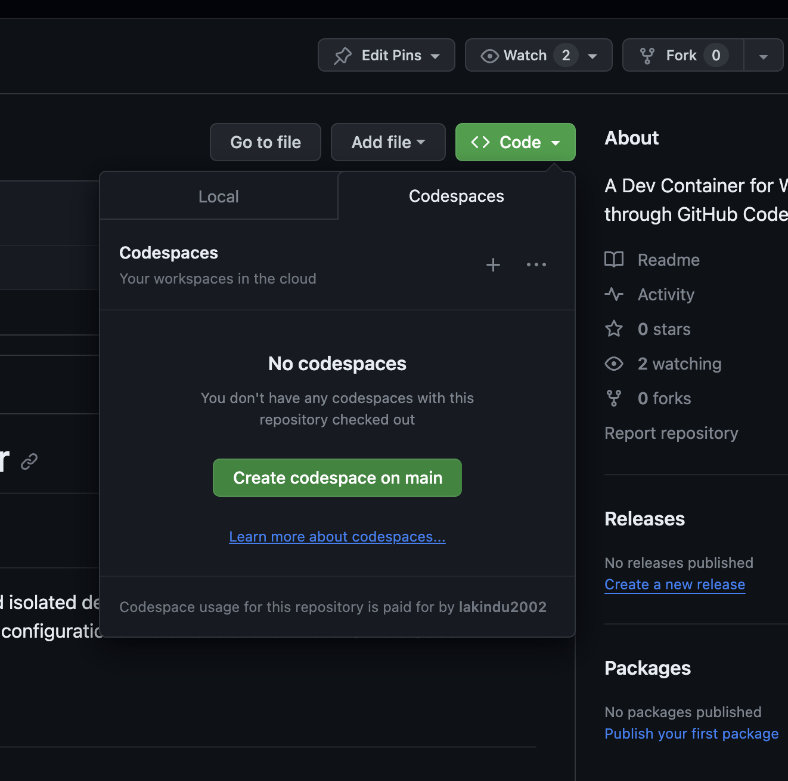

# Bit Development Container: GitHub Codespaces

## Overview

The Bit development container provides a robust and isolated development environment. It is based on the Docker image `bitsrc/stable:latest` and includes custom configurations and extensions for Visual Studio Code (VSCode), optimized for working with Bit.

## Configuration Details
- Container Name: Bit Stable
- Docker Image: bitsrc/stable:latest
- Remote User: bituser
- Forwarded Ports: The configuration currently does not forward any ports.

## Environment Variables

- `BIT_CONFIG_USER_TOKEN`: Set this to your local environment's `BIT_CONFIG_USER_TOKEN` value. This token is crucial for authentication and interaction with Bit services.

## VSCode Customizations

### Extensions
- bit.vscode-bit@latest: This extension is pre-installed and provides integrated support for Bit within VSCode.
Settings
- git.enabled: Disabled (false). This setting turns off Git integration within the VSCode environment for this container.

## Getting Started

1. Fork this repository onto your GitHub.
2. Create GitHub Codespace in the Forked Repository.
3. Run `bit login` and login into your Bit Account through the Codespace.
4. After logging in, run the command - `bit config get user.token` in the Codespace and copy the token.
5. Go to GitHub and add a secret named - `BIT_CONFIG_USER_TOKEN` and provide the copied value from terminal. The URL is - https://github.com/settings/codespaces. Give access to the repository that you forked into to let that repo consume the variable. This is a one time action that you need to perform.

---
If you need help creating the Codespace, it's attached below:

## Working with Bit

Use the Bit Plugin or Bit CLI to work with Bit.

Learn More about the Plugin: https://blog.bitsrc.io/bit-extension-for-vs-code-boosting-dev-productivity-75c7a2b48334

